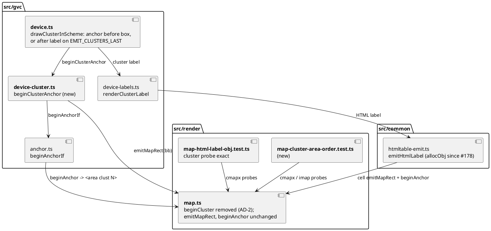

# Component map: issue #179

The modules T1 touches (bold) and the ones it only reads.

```plantuml
@startuml
package "src/gvc" {
  [**device.ts**\ndrawClusterInScheme: anchor before box,\nor after label on EMIT_CLUSTERS_LAST] as dev
  [**device-cluster.ts**\nbeginClusterAnchor (new)] as dc
  [anchor.ts\nbeginAnchorIf] as anc
  [device-labels.ts\nrenderClusterLabel] as dl
}
package "src/common" {
  [htmltable-emit.ts\nemitHtmlLabel (allocObj since #178)] as hte
}
package "src/render" {
  [**map.ts**\nbeginCluster removed (AD-2);\nemitMapRect, beginAnchor unchanged] as map
  [**map-cluster-area-order.test.ts**\n(new)] as t
  [**map-html-label-obj.test.ts**\ncluster probe exact] as t178
}
dev --> dc : beginClusterAnchor
dc --> map : emitMapRect(bb)
dc --> anc : beginAnchorIf
anc --> map : beginAnchor -> <area clust N>
dev --> dl : cluster label
dl --> hte : HTML label
hte --> map : cell emitMapRect + beginAnchor
t --> map : cmapx / imap probes
t178 --> map : cmapx probes
@enduml
```
