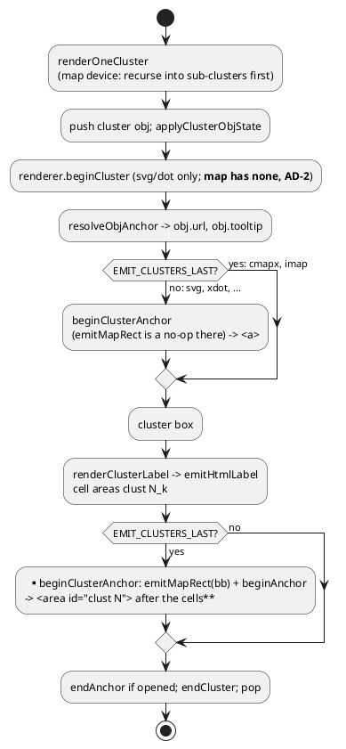

# Data flow: issue #179

The emit order of one anchored cluster after T1. The changed steps are in
bold.

```plantuml
@startuml
start
:renderOneCluster\n(map device: recurse into sub-clusters first);
:push cluster obj; applyClusterObjState;
:renderer.beginCluster (svg/dot only; **map has none, AD-2**);
:resolveObjAnchor -> obj.url, obj.tooltip;
if (EMIT_CLUSTERS_LAST?) then (no: svg, xdot, ...)
  :beginClusterAnchor\n(emitMapRect is a no-op there) -> <a>;
else (yes: cmapx, imap)
endif
:cluster box;
:renderClusterLabel -> emitHtmlLabel\ncell areas clust N_k;
if (EMIT_CLUSTERS_LAST?) then (yes)
  :**beginClusterAnchor: emitMapRect(bb) + beginAnchor\n-> <area id="clust N"> after the cells**;
else (no)
endif
:endAnchor if opened; endCluster; pop;
stop
@enduml
```
