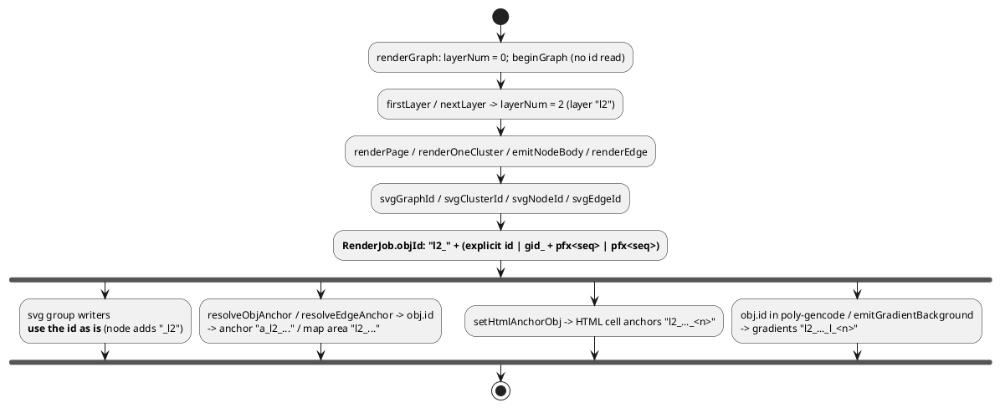

# Data flow: issue #180

Where an object id comes from after T1, on a layer after the first. The
changed steps are in bold.

```plantuml
@startuml
start
:renderGraph: layerNum = 0; beginGraph (no id read);
:firstLayer / nextLayer -> layerNum = 2 (layer "l2");
:renderPage / renderOneCluster / emitNodeBody / renderEdge;
:svgGraphId / svgClusterId / svgNodeId / svgEdgeId;
:**RenderJob.objId: "l2_" + (explicit id | gid_ + pfx<seq> | pfx<seq>)**;
fork
  :svg group writers\n**use the id as is** (node adds "_l2");
fork again
  :resolveObjAnchor / resolveEdgeAnchor -> obj.id\n-> anchor "a_l2_..." / map area "l2_...";
fork again
  :setHtmlAnchorObj -> HTML cell anchors "l2_..._<n>";
fork again
  :obj.id in poly-gencode / emitGradientBackground\n-> gradients "l2_..._l_<n>";
end fork
stop
@enduml
```
