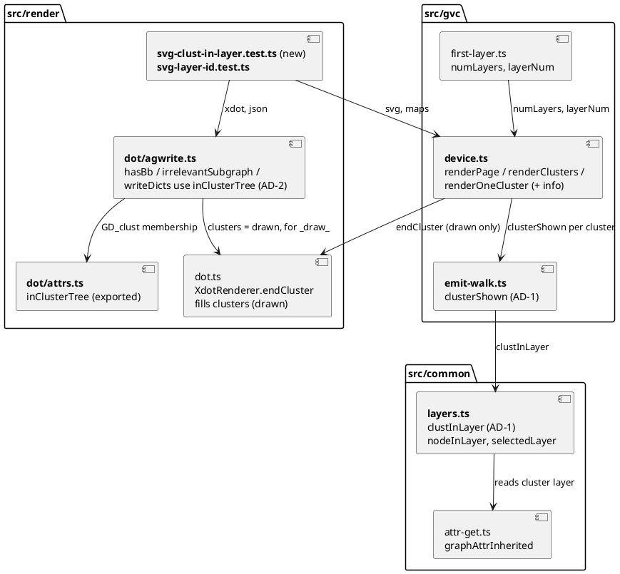

# Component map: issue #181

The modules T1 touches (bold) and the ones it only reads.

```plantuml
@startuml
package "src/common" {
  [**layers.ts**\nclustInLayer (AD-1)\nnodeInLayer, selectedLayer] as lay
  [attr-get.ts\ngraphAttrInherited] as ag
}
package "src/gvc" {
  [**emit-walk.ts**\nclusterShown (AD-1)] as ew
  [**device.ts**\nrenderPage / renderClusters /\nrenderOneCluster (+ info)] as dev
  [first-layer.ts\nnumLayers, layerNum] as fl
}
package "src/render" {
  [dot.ts\nXdotRenderer.endCluster\nfills clusters (drawn)] as xr
  [**dot/agwrite.ts**\nhasBb / irrelevantSubgraph /\nwriteDicts use inClusterTree (AD-2)] as aw
  [**dot/attrs.ts**\ninClusterTree (exported)] as at
  [**svg-clust-in-layer.test.ts** (new)\n**svg-layer-id.test.ts**] as t
}
lay --> ag : reads cluster layer
ew --> lay : clustInLayer
dev --> ew : clusterShown per cluster
fl --> dev : numLayers, layerNum
dev --> xr : endCluster (drawn only)
aw --> at : GD_clust membership
aw --> xr : clusters = drawn, for _draw_
t --> dev : svg, maps
t --> aw : xdot, json
@enduml
```
