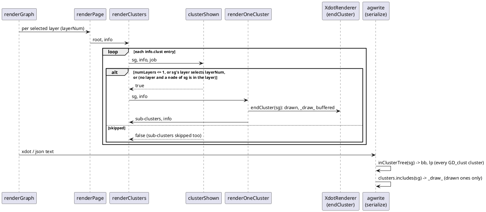

# Data flow: issue #181

One render after T1: which clusters each layer draws, and where the xdot
writer gets its cluster facts.

```plantuml
@startuml
participant renderGraph
participant renderPage
participant renderClusters
participant clusterShown
participant renderOneCluster
participant "XdotRenderer\n(endCluster)" as xr
participant "agwrite\n(serialize)" as aw

renderGraph -> renderPage : per selected layer (layerNum)
renderPage -> renderClusters : root, info
loop each info.clust entry
  renderClusters -> clusterShown : sg, info, job
  alt numLayers <= 1, or sg's layer selects layerNum,\nor (no layer and a node of sg is in the layer)
    clusterShown --> renderClusters : true
    renderClusters -> renderOneCluster : sg, info
    renderOneCluster -> xr : endCluster(sg): drawn, _draw_ buffered
    renderOneCluster -> renderClusters : sub-clusters, info
  else skipped
    clusterShown --> renderClusters : false (sub-clusters skipped too)
  end
end
renderGraph -> aw : xdot / json text
aw -> aw : inClusterTree(sg) -> bb, lp (every GD_clust cluster)
aw -> aw : clusters.includes(sg) -> _draw_ (drawn ones only)
@enduml
```
