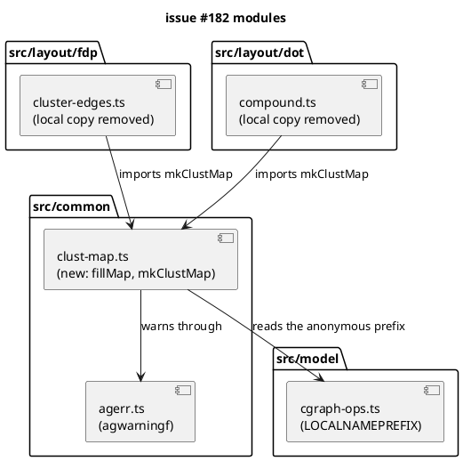

# Component map: modules T1 touches

```plantuml
@startuml
title issue #182 modules
package "src/common" {
  [clust-map.ts\n(new: fillMap, mkClustMap)] as CM
  [agerr.ts\n(agwarningf)] as AG
}
package "src/model" {
  [cgraph-ops.ts\n(LOCALNAMEPREFIX)] as CO
}
package "src/layout/fdp" {
  [cluster-edges.ts\n(local copy removed)] as FE
}
package "src/layout/dot" {
  [compound.ts\n(local copy removed)] as DC
}
FE --> CM : imports mkClustMap
DC --> CM : imports mkClustMap
CM --> AG : warns through
CM --> CO : reads the anonymous prefix
@enduml
```
