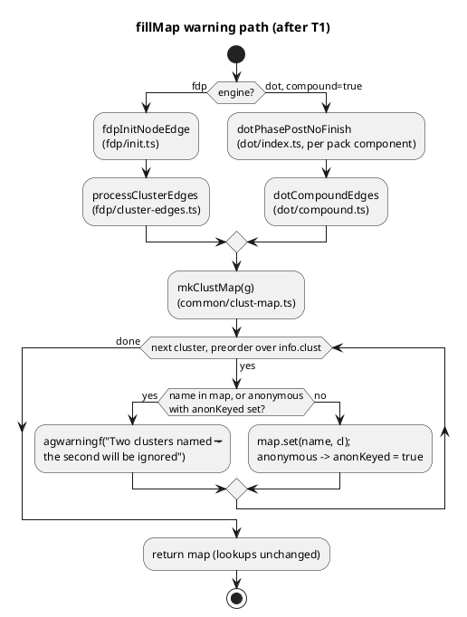

# Data flow: where fillMap's warning is written

```plantuml
@startuml
title fillMap warning path (after T1)
start
if (engine?) then (fdp)
  :fdpInitNodeEdge\n(fdp/init.ts);
  :processClusterEdges\n(fdp/cluster-edges.ts);
else (dot, compound=true)
  :dotPhasePostNoFinish\n(dot/index.ts, per pack component);
  :dotCompoundEdges\n(dot/compound.ts);
endif
:mkClustMap(g)\n(common/clust-map.ts);
while (next cluster, preorder over info.clust) is (yes)
  if (name in map, or anonymous\nwith anonKeyed set?) then (yes)
    :agwarningf("Two clusters named <s> -\nthe second will be ignored");
  else (no)
    :map.set(name, cl);\nanonymous -> anonKeyed = true;
  endif
endwhile (done)
:return map (lookups unchanged);
stop
@enduml
```
