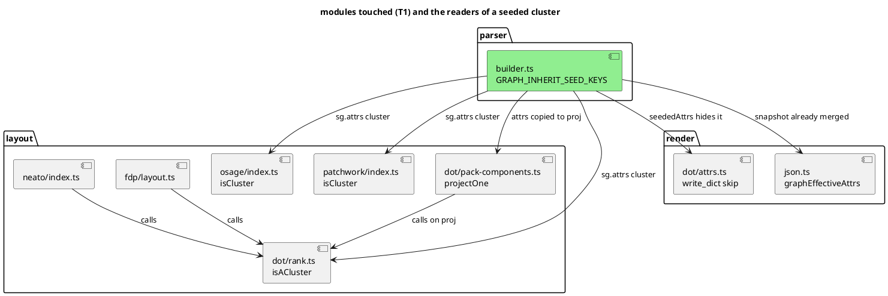

# Component map: issue #183

```plantuml
@startuml
title modules touched (T1) and the readers of a seeded cluster
package "parser" {
  [builder.ts\nGRAPH_INHERIT_SEED_KEYS] as B #lightgreen
}
package "layout" {
  [dot/rank.ts\nisACluster] as R
  [osage/index.ts\nisCluster] as O
  [patchwork/index.ts\nisCluster] as P
  [dot/pack-components.ts\nprojectOne] as PK
  [fdp/layout.ts] as F
  [neato/index.ts] as N
}
package "render" {
  [dot/attrs.ts\nwrite_dict skip] as W
  [json.ts\ngraphEffectiveAttrs] as J
}
B --> R : sg.attrs cluster
B --> O : sg.attrs cluster
B --> P : sg.attrs cluster
B --> PK : attrs copied to proj
B --> W : seededAttrs hides it
B --> J : snapshot already merged
F --> R : calls
N --> R : calls
PK --> R : calls on proj
@enduml
```

Green marks the only source file T1 changes.
