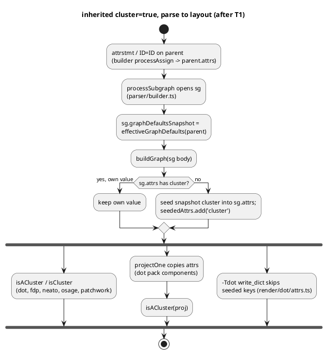

# Data flow: an inherited `cluster` value (after T1)

```plantuml
@startuml
title inherited cluster=true, parse to layout (after T1)
start
:attrstmt / ID=ID on parent\n(builder processAssign -> parent.attrs);
:processSubgraph opens sg\n(parser/builder.ts);
:sg.graphDefaultsSnapshot =\neffectiveGraphDefaults(parent);
:buildGraph(sg body);
if (sg.attrs has cluster?) then (yes, own value)
  :keep own value;
else (no)
  :seed snapshot cluster into sg.attrs;\nseededAttrs.add('cluster');
endif
fork
  :isACluster / isCluster\n(dot, fdp, neato, osage, patchwork);
fork again
  :projectOne copies attrs\n(dot pack components);
  :isACluster(proj);
fork again
  :-Tdot write_dict skips\nseeded keys (render/dot/attrs.ts);
end fork
stop
@enduml
```
