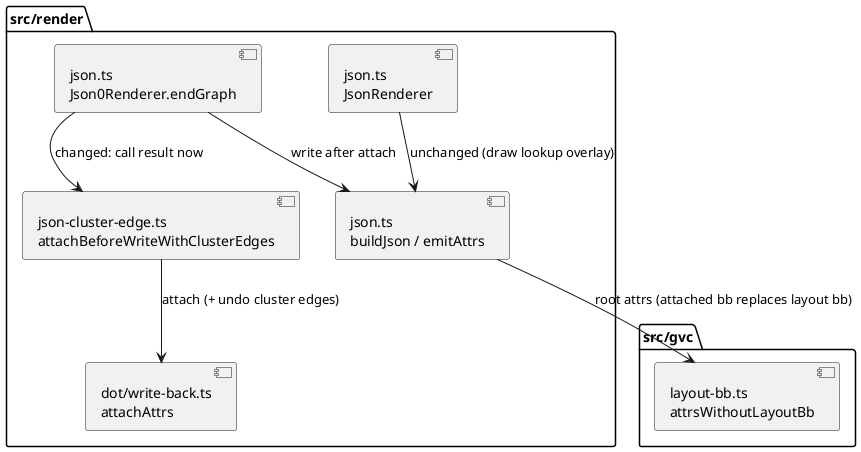

# Component map

```plantuml
@startuml
package "src/render" {
  [json.ts\nJson0Renderer.endGraph] as J0
  [json.ts\nJsonRenderer] as J
  [json.ts\nbuildJson / emitAttrs] as BJ
  [json-cluster-edge.ts\nattachBeforeWriteWithClusterEdges] as H
  [dot/write-back.ts\nattachAttrs] as WB
}
package "src/gvc" {
  [layout-bb.ts\nattrsWithoutLayoutBb] as LB
}
J0 --> H : changed: call result now
H --> WB : attach (+ undo cluster edges)
J0 --> BJ : write after attach
J --> BJ : unchanged (draw lookup overlay)
BJ --> LB : root attrs (attached bb replaces layout bb)
@enduml
```

Changed: `Json0Renderer.endGraph` and comments in `json.ts` and
`json-cluster-edge.ts`. Unchanged: `JsonRenderer`, `attachAttrs`, `buildJson`.
