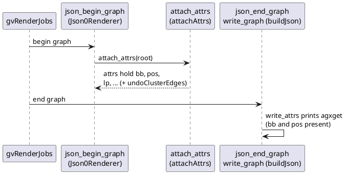
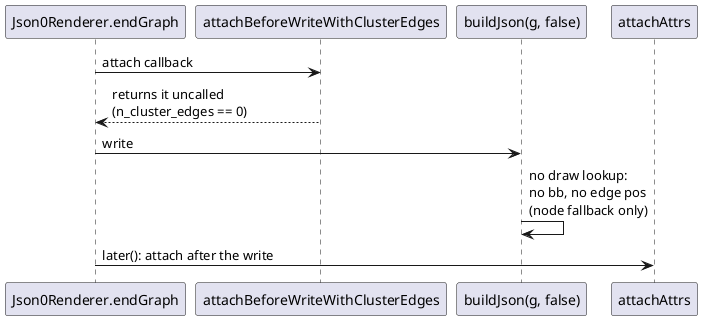

# Data flow: where json0's `bb` and `pos` come from

C (16.1.1) and the port after T1:

```plantuml
@startuml
participant "gvRenderJobs" as R
participant "json_begin_graph\n(Json0Renderer)" as B
participant "attach_attrs\n(attachAttrs)" as A
participant "json_end_graph\nwrite_graph (buildJson)" as W
R -> B : begin graph
B -> A : attach_attrs(root)
A --> B : attrs hold bb, pos,\nlp, ... (+ undoClusterEdges)
R -> W : end graph
W -> W : write_attrs prints agxget\n(bb and pos present)
@enduml
```

The port on the base (no cluster edges):

```plantuml
@startuml
participant "Json0Renderer.endGraph" as E
participant "attachBeforeWriteWithClusterEdges" as H
participant "buildJson(g, false)" as W
participant "attachAttrs" as A
E -> H : attach callback
H --> E : returns it uncalled\n(n_cluster_edges == 0)
E -> W : write
W -> W : no draw lookup:\nno bb, no edge pos\n(node fallback only)
E -> A : later(): attach after the write
@enduml
```
