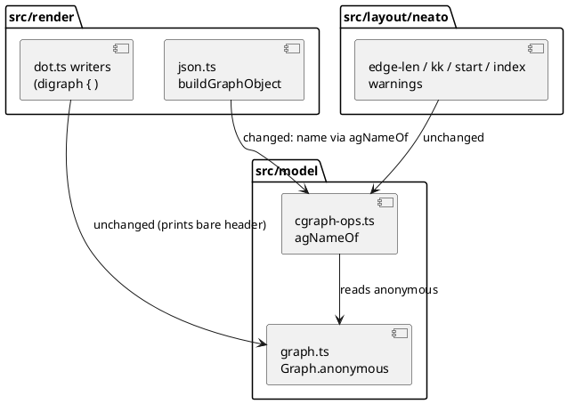

# Component map

```plantuml
@startuml
package "src/render" {
  [json.ts\nbuildGraphObject] as BG
  [dot.ts writers\n(digraph { )] as DW
}
package "src/model" {
  [cgraph-ops.ts\nagNameOf] as AN
  [graph.ts\nGraph.anonymous] as G
}
package "src/layout/neato" {
  [edge-len / kk / start / index\nwarnings] as NW
}
BG --> AN : changed: name via agNameOf
NW --> AN : unchanged
AN --> G : reads anonymous
DW --> G : unchanged (prints bare header)
@enduml
```

Changed: `buildGraphObject` in `json.ts`. Unchanged: `agNameOf`, the model, the
dot/xdot writers, the map writer (already prints `%1`).
