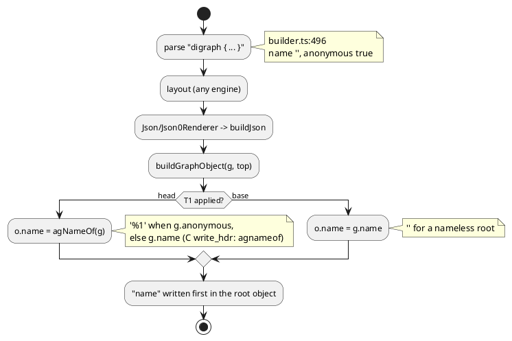

# Data flow: the json root name

C prints `agnameof(g)`; the port printed the stored name. After T1 it prints
`agNameOf(g)`, which restores cgraph's `%1` for a nameless root.

```plantuml
@startuml
start
:parse "digraph { ... }";
note right: builder.ts:496\nname '', anonymous true
:layout (any engine);
:Json/Json0Renderer -> buildJson;
:buildGraphObject(g, top);
if (T1 applied?) then (head)
  :o.name = agNameOf(g);
  note right: '%1' when g.anonymous,\nelse g.name (C write_hdr: agnameof)
else (base)
  :o.name = g.name;
  note right: '' for a nameless root
endif
:"name" written first in the root object;
stop
@enduml
```
