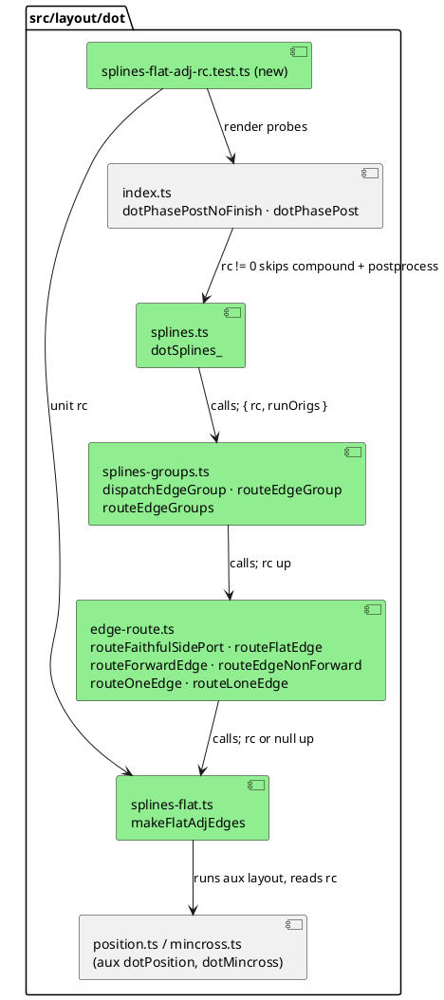

# Component map: issue #187

Four files on one return-code chain change, plus one new test. The callers
above `dotSplines_` (`index.ts`) already handle a non-zero rc and do not
change.

```plantuml
@startuml
package "src/layout/dot" {
  [splines-flat.ts\nmakeFlatAdjEdges] as F #LightGreen
  [edge-route.ts\nrouteFaithfulSidePort · routeFlatEdge\nrouteForwardEdge · routeEdgeNonForward\nrouteOneEdge · routeLoneEdge] as R #LightGreen
  [splines-groups.ts\ndispatchEdgeGroup · routeEdgeGroup\nrouteEdgeGroups] as G #LightGreen
  [splines.ts\ndotSplines_] as S #LightGreen
  [index.ts\ndotPhasePostNoFinish · dotPhasePost] as I
  [position.ts / mincross.ts\n(aux dotPosition, dotMincross)] as P
  [splines-flat-adj-rc.test.ts (new)] as T #LightGreen
}
F --> P : runs aux layout, reads rc
R --> F : calls; rc or null up
G --> R : calls; rc up
S --> G : calls; { rc, runOrigs }
I --> S : rc != 0 skips compound + postprocess
T --> I : render probes
T --> F : unit rc
@enduml
```
