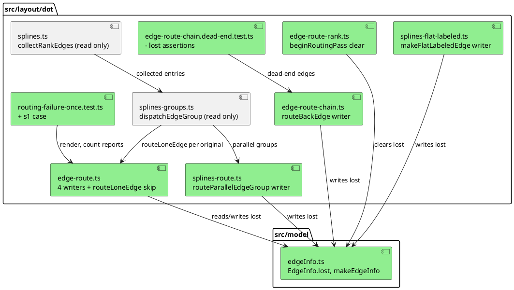

# Component map: issue #188

Six source files lose the field or a use of it. Two tests and one new
fixture change. The group loop and the collection are read, not written.

```plantuml
@startuml
package "src/model" {
  [edgeInfo.ts\nEdgeInfo.lost, makeEdgeInfo] as M #LightGreen
}
package "src/layout/dot" {
  [edge-route.ts\n4 writers + routeLoneEdge skip] as R #LightGreen
  [edge-route-rank.ts\nbeginRoutingPass clear] as K #LightGreen
  [edge-route-chain.ts\nrouteBackEdge writer] as C #LightGreen
  [splines-flat-labeled.ts\nmakeFlatLabeledEdge writer] as L #LightGreen
  [splines-route.ts\nrouteParallelEdgeGroup writer] as P #LightGreen
  [splines-groups.ts\ndispatchEdgeGroup (read only)] as G
  [splines.ts\ncollectRankEdges (read only)] as S
  [routing-failure-once.test.ts\n+ s1 case] as T1 #LightGreen
  [edge-route-chain.dead-end.test.ts\n- lost assertions] as T2 #LightGreen
}
R --> M : reads/writes lost
K --> M : clears lost
C --> M : writes lost
L --> M : writes lost
P --> M : writes lost
G --> R : routeLoneEdge per original
G --> P : parallel groups
S --> G : collected entries
T1 --> R : render, count reports
T2 --> C : dead-end edges
@enduml
```
