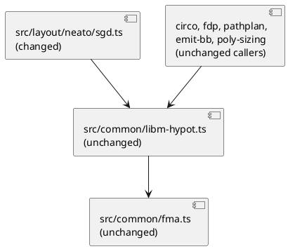

# Component map

```plantuml
@startuml
component "src/layout/neato/sgd.ts\n(changed)" as sgd
component "src/common/libm-hypot.ts\n(unchanged)" as model
component "src/common/fma.ts\n(unchanged)" as fma
component "circo, fdp, pathplan,\nemit-bb, poly-sizing\n(unchanged callers)" as others
sgd --> model
others --> model
model --> fma
@enduml
```
