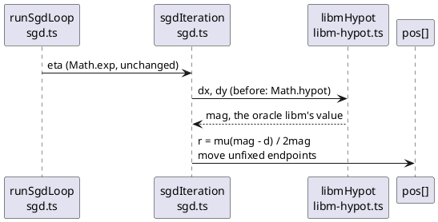

# Data flow: one SGD step

```plantuml
@startuml
participant "runSgdLoop\nsgd.ts" as loop
participant "sgdIteration\nsgd.ts" as iter
participant "libmHypot\nlibm-hypot.ts" as hyp
participant "pos[]" as pos

loop -> iter : eta (Math.exp, unchanged)
iter -> hyp : dx, dy (before: Math.hypot)
hyp --> iter : mag, the oracle libm's value
iter -> pos : r = mu(mag - d) / 2mag\nmove unfixed endpoints
@enduml
```
