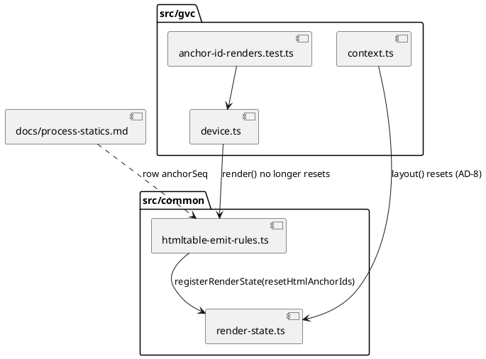

# Component map

```plantuml
@startuml
package "src/gvc" {
  [device.ts] as D
  [context.ts] as C
  [anchor-id-renders.test.ts] as T
}
package "src/common" {
  [htmltable-emit-rules.ts] as H
  [render-state.ts] as S
}
[docs/process-statics.md] as P
D --> H : render() no longer resets
H --> S : registerRenderState(resetHtmlAnchorIds)
C --> S : layout() resets (AD-8)
T --> D
P ..> H : row anchorSeq
@enduml
```
