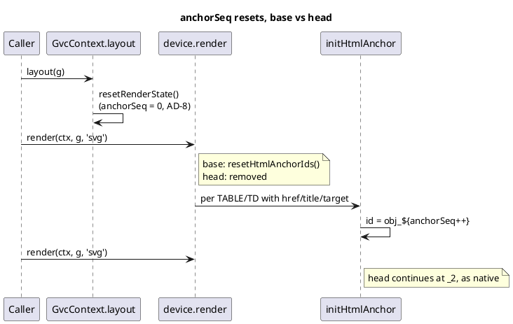

# Data flow: the anchor counter

```plantuml
@startuml
title anchorSeq resets, base vs head
participant Caller
participant "GvcContext.layout" as L
participant "device.render" as R
participant "initHtmlAnchor" as A
Caller -> L: layout(g)
L -> L: resetRenderState()\n(anchorSeq = 0, AD-8)
Caller -> R: render(ctx, g, 'svg')
note right of R: base: resetHtmlAnchorIds()\nhead: removed
R -> A: per TABLE/TD with href/title/target
A -> A: id = obj_${anchorSeq++}
Caller -> R: render(ctx, g, 'svg')
note right of A: head continues at _2, as native
@enduml
```
