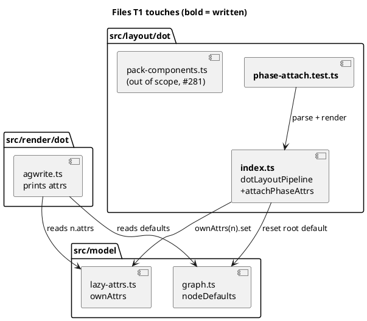

# Component map: issue #192

```plantuml
@startuml
title Files T1 touches (bold = written)
package "src/layout/dot" {
  [**index.ts**\ndotLayoutPipeline\n+attachPhaseAttrs] as IDX
  [**phase-attach.test.ts**] as T
  [pack-components.ts\n(out of scope, #281)] as PK
}
package "src/model" {
  [lazy-attrs.ts\nownAttrs] as LA
  [graph.ts\nnodeDefaults] as GR
}
package "src/render/dot" {
  [agwrite.ts\nprints attrs] as AW
}
IDX --> LA : ownAttrs(n).set
IDX --> GR : reset root default
AW --> GR : reads defaults
AW --> LA : reads n.attrs
T --> IDX : parse + render
@enduml
```
