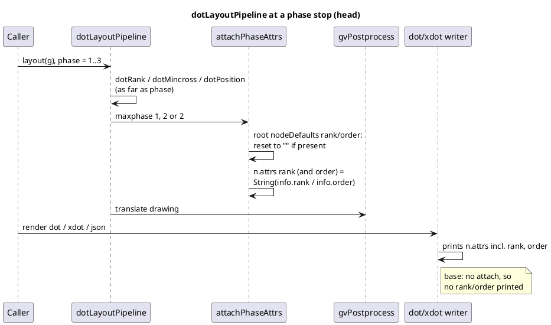

# Data flow: a `phase` stop

```plantuml
@startuml
title dotLayoutPipeline at a phase stop (head)
participant Caller
participant "dotLayoutPipeline" as P
participant "attachPhaseAttrs" as A
participant "gvPostprocess" as G
participant "dot/xdot writer" as W
Caller -> P: layout(g), phase = 1..3
P -> P: dotRank / dotMincross / dotPosition\n(as far as phase)
P -> A: maxphase 1, 2 or 2
A -> A: root nodeDefaults rank/order:\nreset to "" if present
A -> A: n.attrs rank (and order) =\nString(info.rank / info.order)
P -> G: translate drawing
Caller -> W: render dot / xdot / json
W -> W: prints n.attrs incl. rank, order
note right of W: base: no attach, so\nno rank/order printed
@enduml
```
