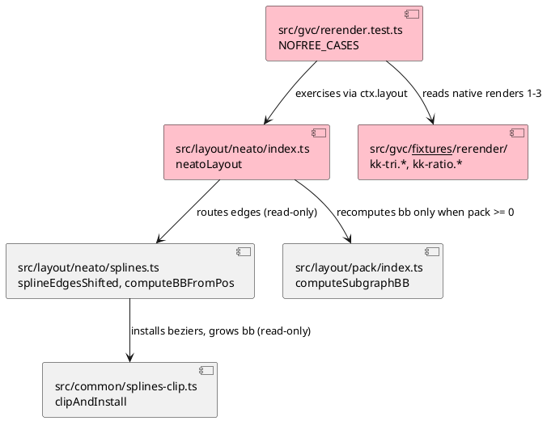

# Component map: modules touched by issue #193

```plantuml
@startuml
component "src/layout/neato/index.ts\nneatoLayout" as idx #pink
component "src/layout/neato/splines.ts\nsplineEdgesShifted, computeBBFromPos" as spl
component "src/common/splines-clip.ts\nclipAndInstall" as clip
component "src/layout/pack/index.ts\ncomputeSubgraphBB" as pack
component "src/gvc/rerender.test.ts\nNOFREE_CASES" as test #pink
component "src/gvc/__fixtures__/rerender/\nkk-tri.*, kk-ratio.*" as fx #pink
idx --> spl : routes edges (read-only)
spl --> clip : installs beziers, grows bb (read-only)
idx --> pack : recomputes bb only when pack >= 0
test --> fx : reads native renders 1-3
test --> idx : exercises via ctx.layout
@enduml
```

Pink: files written. The rest are read only.
