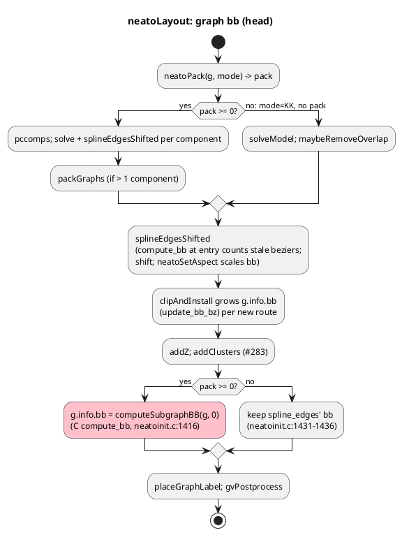

# Data flow: where neato's graph bb comes from

Head (proposed). The base differs only in the pink step: it runs the
recompute on both branches.

```plantuml
@startuml
title neatoLayout: graph bb (head)
start
:neatoPack(g, mode) -> pack;
if (pack >= 0?) then (yes)
  :pccomps; solve + splineEdgesShifted per component;
  :packGraphs (if > 1 component);
else (no: mode=KK, no pack)
  :solveModel; maybeRemoveOverlap;
endif
:splineEdgesShifted\n(compute_bb at entry counts stale beziers;\nshift; neatoSetAspect scales bb);
:clipAndInstall grows g.info.bb\n(update_bb_bz) per new route;
:addZ; addClusters (#283);
if (pack >= 0?) then (yes)
  #pink:g.info.bb = computeSubgraphBB(g, 0)\n(C compute_bb, neatoinit.c:1416);
else (no)
  :keep spline_edges' bb\n(neatoinit.c:1431-1436);
endif
:placeGraphLabel; gvPostprocess;
stop
@enduml
```
