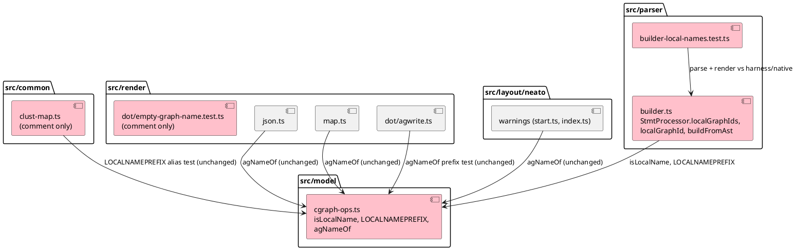

# Component map: modules #194 touches

```plantuml
@startuml
package "src/parser" {
  [builder.ts\nStmtProcessor.localGraphIds,\nlocalGraphId, buildFromAst] as B #pink
  [builder-local-names.test.ts] as T #pink
}
package "src/model" {
  [cgraph-ops.ts\nisLocalName, LOCALNAMEPREFIX,\nagNameOf] as C #pink
}
package "src/common" {
  [clust-map.ts\n(comment only)] as M #pink
}
package "src/render" {
  [json.ts] as J
  [map.ts] as P
  [dot/agwrite.ts] as W
  [dot/empty-graph-name.test.ts\n(comment only)] as E #pink
}
package "src/layout/neato" {
  [warnings (start.ts, index.ts)] as N
}
B --> C : isLocalName, LOCALNAMEPREFIX
J --> C : agNameOf (unchanged)
P --> C : agNameOf (unchanged)
W --> C : agNameOf prefix test (unchanged)
N --> C : agNameOf (unchanged)
M --> C : LOCALNAMEPREFIX alias test (unchanged)
T --> B : parse + render vs harness/native
@enduml
```

Pink: written by T1. The rest read the model and are unchanged.
