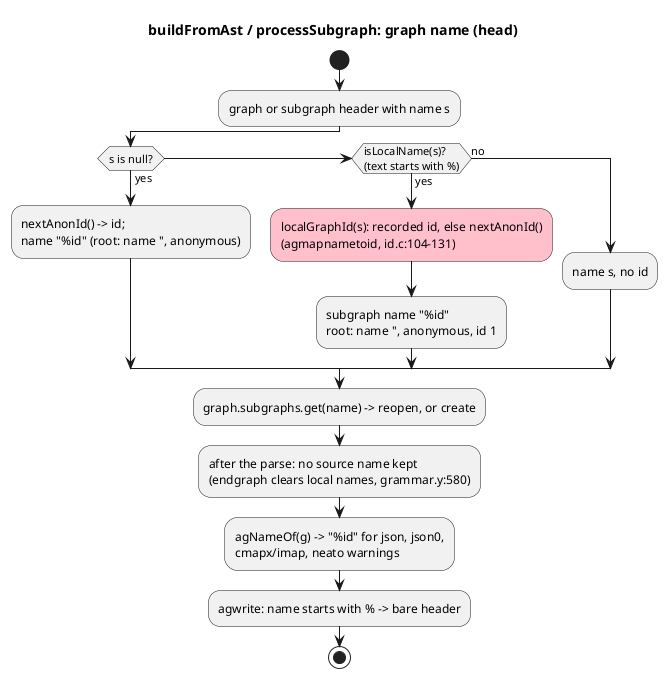

# Data flow: a `%`-prefixed graph name, parse to output

Head (proposed). On the base the name skips the pink step: it is stored as
written and takes no anonymous id.

```plantuml
@startuml
title buildFromAst / processSubgraph: graph name (head)
start
:graph or subgraph header with name s;
if (s is null?) then (yes)
  :nextAnonId() -> id;\nname "%id" (root: name '', anonymous);
elseif (isLocalName(s)?\n(text starts with %)) then (yes)
  #pink:localGraphId(s): recorded id, else nextAnonId()\n(agmapnametoid, id.c:104-131);
  :subgraph name "%id"\nroot: name '', anonymous, id 1;
else (no)
  :name s, no id;
endif
:graph.subgraphs.get(name) -> reopen, or create;
:after the parse: no source name kept\n(endgraph clears local names, grammar.y:580);
:agNameOf(g) -> "%id" for json, json0,\ncmapx/imap, neato warnings;
:agwrite: name starts with % -> bare header;
stop
@enduml
```
