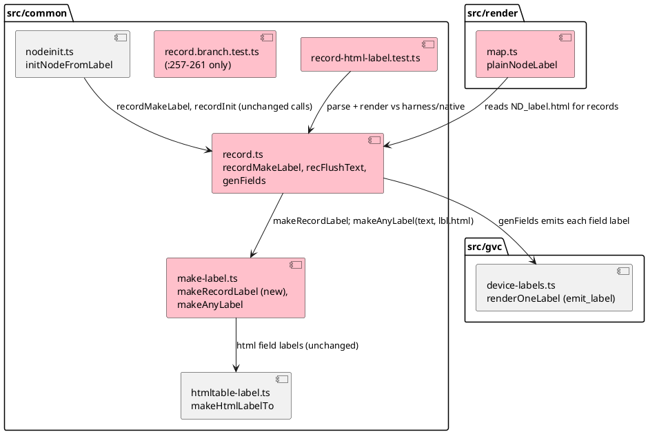

# Component map: modules #195 touches

```plantuml
@startuml
package "src/common" {
  [make-label.ts\nmakeRecordLabel (new),\nmakeAnyLabel] as L #pink
  [record.ts\nrecordMakeLabel, recFlushText,\ngenFields] as R #pink
  [record-html-label.test.ts] as T #pink
  [record.branch.test.ts\n(:257-261 only)] as B #pink
  [htmltable-label.ts\nmakeHtmlLabelTo] as H
  [nodeinit.ts\ninitNodeFromLabel] as N
}
package "src/gvc" {
  [device-labels.ts\nrenderOneLabel (emit_label)] as D
}
package "src/render" {
  [map.ts\nplainNodeLabel] as P #pink
}
N --> R : recordMakeLabel, recordInit (unchanged calls)
R --> L : makeRecordLabel; makeAnyLabel(text, lbl.html)
L --> H : html field labels (unchanged)
R --> D : genFields emits each field label
P --> R : reads ND_label.html for records
T --> R : parse + render vs harness/native
@enduml
```

Pink: written by T1. The rest are called as they are.
