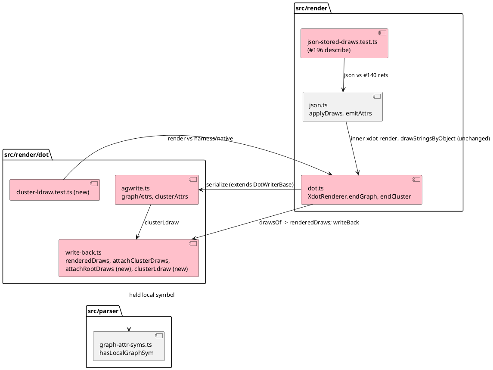

# Component map: modules #196 touches

```plantuml
@startuml
package "src/render" {
  [dot.ts\nXdotRenderer.endGraph, endCluster] as X #pink
  [json.ts\napplyDraws, emitAttrs] as J
  [json-stored-draws.test.ts\n(#196 describe)] as JT #pink
}
package "src/render/dot" {
  [write-back.ts\nrenderedDraws, attachClusterDraws,\nattachRootDraws (new), clusterLdraw (new)] as W #pink
  [agwrite.ts\ngraphAttrs, clusterAttrs] as A #pink
  [cluster-ldraw.test.ts (new)] as T #pink
}
package "src/parser" {
  [graph-attr-syms.ts\nhasLocalGraphSym] as S
}
X --> W : drawsOf -> renderedDraws; writeBack
X --> A : serialize (extends DotWriterBase)
A --> W : clusterLdraw
W --> S : held local symbol
J --> X : inner xdot render, drawStringsByObject (unchanged)
T --> X : render vs harness/native
JT --> J : json vs #140 refs
@enduml
```

Pink: written by T1. The rest are called as they are.
