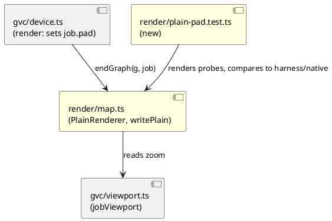

# Component map

```plantuml
@startuml
component "gvc/device.ts\n(render: sets job.pad)" as D
component "render/map.ts\n(PlainRenderer, writePlain)" as M #LightYellow
component "gvc/viewport.ts\n(jobViewport)" as V
component "render/plain-pad.test.ts\n(new)" as T #LightYellow
D --> M : endGraph(g, job)
M --> V : reads zoom
T --> M : renders probes, compares to harness/native
@enduml
```

Yellow: written by T1. `device.ts` and `viewport.ts` are read only.
