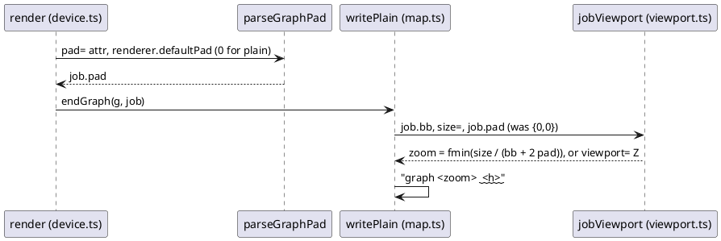

# Data flow: `pad=` to plain's graph line

```plantuml
@startuml
participant "render (device.ts)" as R
participant "parseGraphPad" as P
participant "writePlain (map.ts)" as W
participant "jobViewport (viewport.ts)" as V
R -> P : pad= attr, renderer.defaultPad (0 for plain)
P --> R : job.pad
R -> W : endGraph(g, job)
W -> V : job.bb, size=, job.pad (was {0,0})
V --> W : zoom = fmin(size / (bb + 2 pad)), or viewport= Z
W -> W : "graph <zoom> <w> <h>"
@enduml
```
