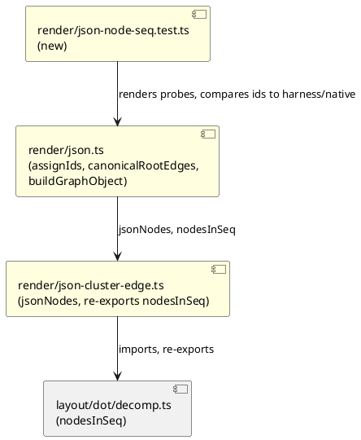

# Component map

```plantuml
@startuml
component "layout/dot/decomp.ts\n(nodesInSeq)" as S
component "render/json-cluster-edge.ts\n(jsonNodes, re-exports nodesInSeq)" as C #LightYellow
component "render/json.ts\n(assignIds, canonicalRootEdges,\nbuildGraphObject)" as J #LightYellow
component "render/json-node-seq.test.ts\n(new)" as T #LightYellow
C --> S : imports, re-exports
J --> C : jsonNodes, nodesInSeq
T --> J : renders probes, compares ids to harness/native
@enduml
```

Yellow: written by T1. `decomp.ts` is read only.
