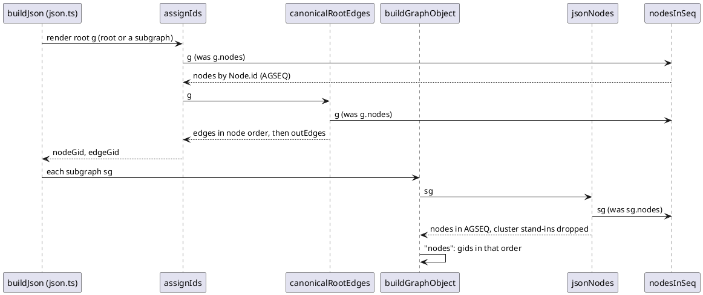

# Data flow: node order into json's ids and member lists

```plantuml
@startuml
participant "buildJson (json.ts)" as B
participant "assignIds" as A
participant "canonicalRootEdges" as E
participant "buildGraphObject" as G
participant "jsonNodes" as N
participant "nodesInSeq" as S
B -> A : render root g (root or a subgraph)
A -> S : g (was g.nodes)
S --> A : nodes by Node.id (AGSEQ)
A -> E : g
E -> S : g (was g.nodes)
E --> A : edges in node order, then outEdges
A --> B : nodeGid, edgeGid
B -> G : each subgraph sg
G -> N : sg
N -> S : sg (was sg.nodes)
N --> G : nodes in AGSEQ, cluster stand-ins dropped
G -> G : "nodes": gids in that order
@enduml
```
