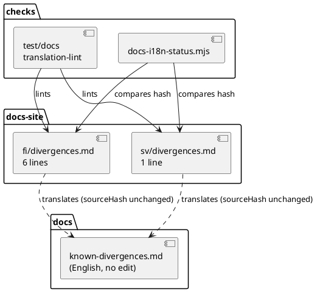

# Component map

```plantuml
@startuml
package "docs" {
  [known-divergences.md\n(English, no edit)] as en
}
package "docs-site" {
  [fi/divergences.md\n6 lines] as fi
  [sv/divergences.md\n1 line] as sv
}
package "checks" {
  [test/docs\ntranslation-lint] as t
  [docs-i18n-status.mjs] as st
}
fi ..> en : translates (sourceHash unchanged)
sv ..> en : translates (sourceHash unchanged)
t --> fi : lints
t --> sv : lints
st --> fi : compares hash
st --> sv : compares hash
@enduml
```
