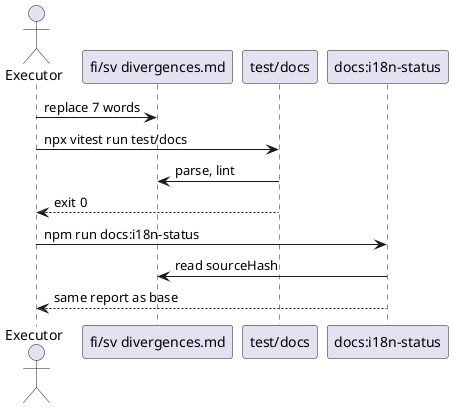

# Data flow

```plantuml
@startuml
actor Executor
participant "fi/sv divergences.md" as page
participant "test/docs" as lint
participant "docs:i18n-status" as st
Executor -> page : replace 7 words
Executor -> lint : npx vitest run test/docs
lint -> page : parse, lint
lint --> Executor : exit 0
Executor -> st : npm run docs:i18n-status
st -> page : read sourceHash
st --> Executor : same report as base
@enduml
```
