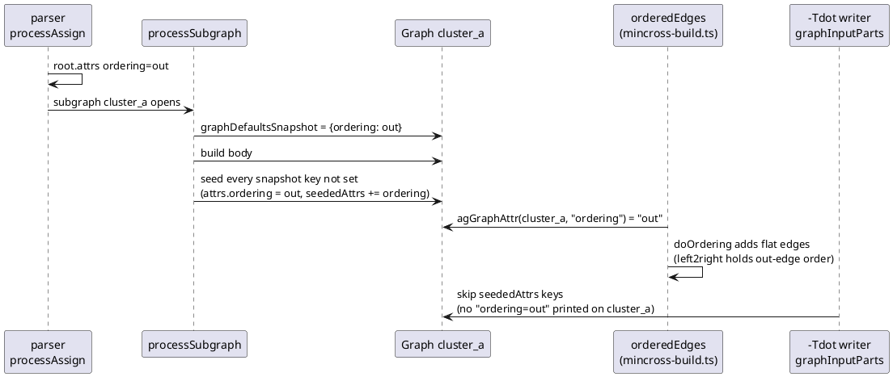

# Data flow: a root `ordering=out` reaching a cluster

Proposed (head). On the base the seeding step copied only the label family and
`cluster`, so the cluster read `""`.

```plantuml
@startuml
participant "parser\nprocessAssign" as P
participant "processSubgraph" as S
participant "Graph cluster_a" as C
participant "orderedEdges\n(mincross-build.ts)" as M
participant "-Tdot writer\ngraphInputParts" as W
P -> P : root.attrs ordering=out
P -> S : subgraph cluster_a opens
S -> C : graphDefaultsSnapshot = {ordering: out}
S -> C : build body
S -> C : seed every snapshot key not set\n(attrs.ordering = out, seededAttrs += ordering)
M -> C : agGraphAttr(cluster_a, "ordering") = "out"
M -> M : doOrdering adds flat edges\n(left2right holds out-edge order)
W -> C : skip seededAttrs keys\n(no "ordering=out" printed on cluster_a)
@enduml
```
