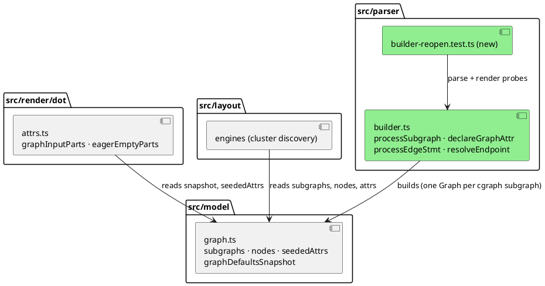

# Component map: issue #258

Only `builder.ts` changes. The writer and layout read the model it builds;
they change no code, and their output moves only on re-open inputs.

```plantuml
@startuml
package "src/parser" {
  [builder.ts\nprocessSubgraph · declareGraphAttr\nprocessEdgeStmt · resolveEndpoint] as B #LightGreen
  [builder-reopen.test.ts (new)] as T #LightGreen
}
package "src/model" {
  [graph.ts\nsubgraphs · nodes · seededAttrs\ngraphDefaultsSnapshot] as G
}
package "src/render/dot" {
  [attrs.ts\ngraphInputParts · eagerEmptyParts] as W
}
package "src/layout" {
  [engines (cluster discovery)] as L
}
B --> G : builds (one Graph per cgraph subgraph)
T --> B : parse + render probes
W --> G : reads snapshot, seededAttrs
L --> G : reads subgraphs, nodes, attrs
@enduml
```
