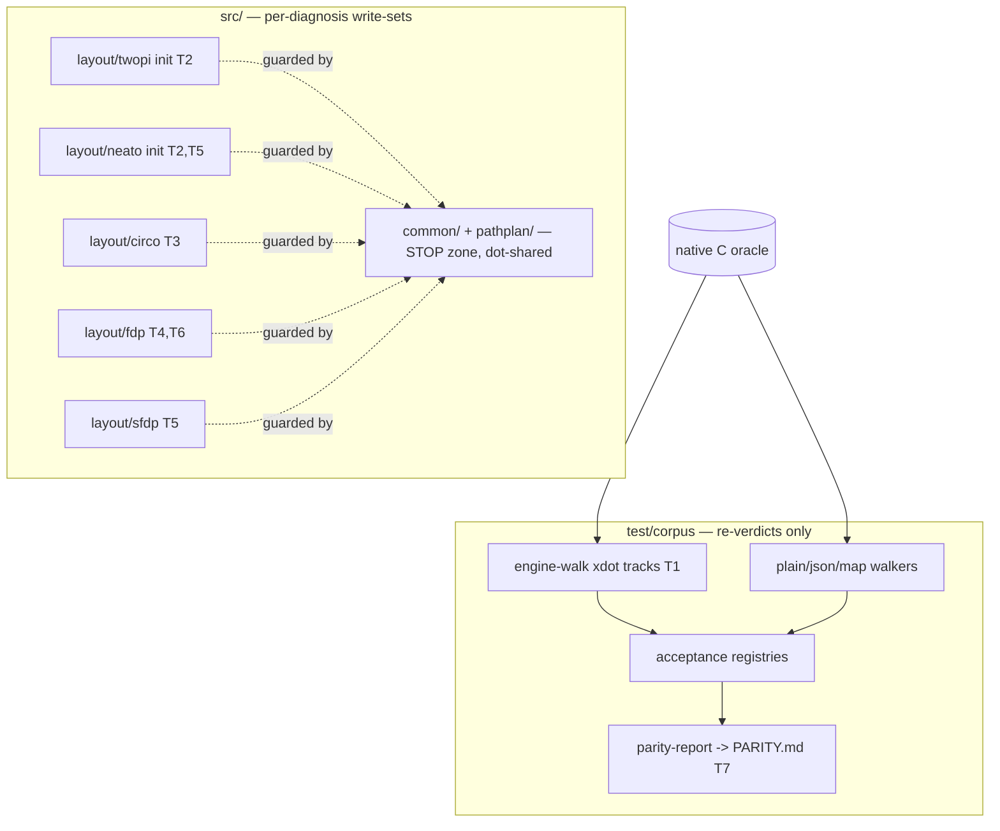

<!-- SPDX-License-Identifier: EPL-2.0 -->

# Component map — what this mission touches

```mermaid
graph TD
    subgraph src [src/ — per-diagnosis write-sets]
        TW[layout/twopi init T2]
        NE[layout/neato init T2,T5]
        CI[layout/circo T3]
        FD[layout/fdp T4,T6]
        SF[layout/sfdp T5]
        COMMON[common/ + pathplan/ — STOP zone, dot-shared]
    end
    subgraph harness [test/corpus — re-verdicts only]
        EWALK[engine-walk xdot tracks T1]
        WALKERS[plain/json/map walkers]
        REG[acceptance registries]
        REPORT[parity-report -> PARITY.md T7]
    end
    ORACLE[(native C oracle)]

    TW & NE & CI & FD & SF -.->|guarded by| COMMON
    EWALK --> REG
    WALKERS --> REG
    ORACLE --> EWALK & WALKERS
    REG --> REPORT
```
