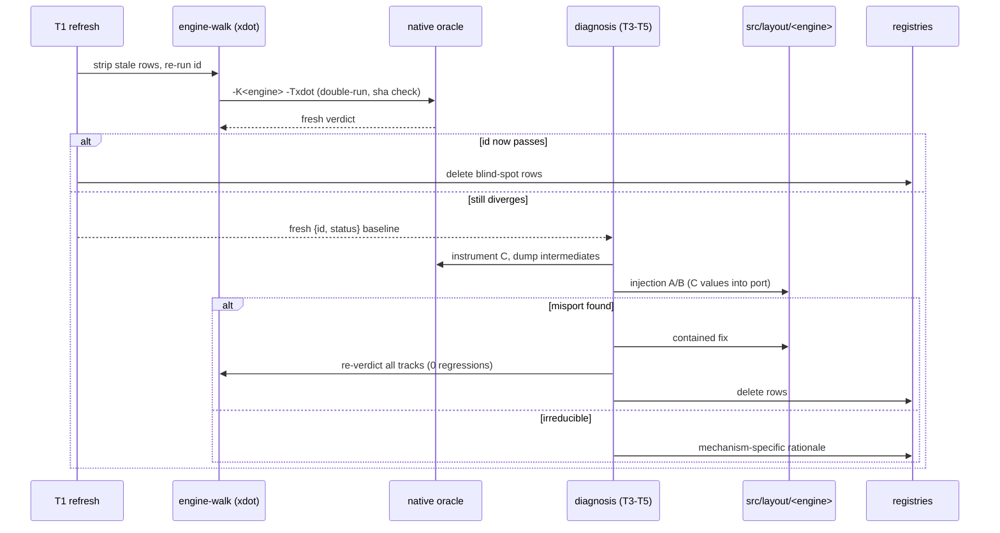

<!-- SPDX-License-Identifier: EPL-2.0 -->

# Data flow — diagnosis loop per blind-spot id

```mermaid
sequenceDiagram
    participant T1 as T1 refresh
    participant EW as engine-walk (xdot)
    participant OR as native oracle
    participant DX as diagnosis (T3-T5)
    participant SRC as src/layout/<engine>
    participant REG as registries

    T1->>EW: strip stale rows, re-run id
    EW->>OR: -K<engine> -Txdot (double-run, sha check)
    OR-->>EW: fresh verdict
    alt id now passes
        T1->>REG: delete blind-spot rows
    else still diverges
        T1-->>DX: fresh {id, status} baseline
        DX->>OR: instrument C, dump intermediates
        DX->>SRC: injection A/B (C values into port)
        alt misport found
            DX->>SRC: contained fix
            DX->>EW: re-verdict all tracks (0 regressions)
            DX->>REG: delete rows
        else irreducible
            DX->>REG: mechanism-specific rationale
        end
    end
```
