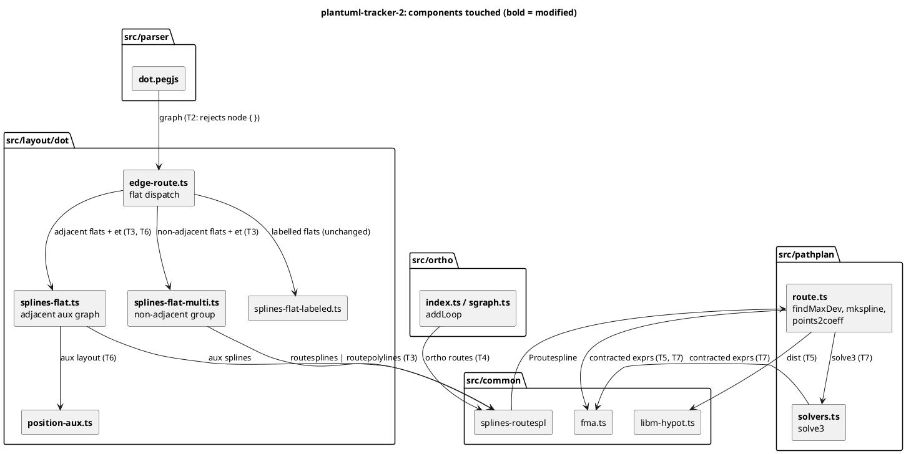

# Component map — touched components

```plantuml
@startuml
skinparam componentStyle rectangle
title plantuml-tracker-2: components touched (bold = modified)

package "src/parser" {
  [**dot.pegjs**] as PEG
}
package "src/layout/dot" {
  [**edge-route.ts**\nflat dispatch] as ER
  [**splines-flat-multi.ts**\nnon-adjacent group] as SFM
  [**splines-flat.ts**\nadjacent aux graph] as SF
  [splines-flat-labeled.ts] as SFL
  [**position-aux.ts**] as PA
}
package "src/ortho" {
  [**index.ts / sgraph.ts**\naddLoop] as OR
}
package "src/pathplan" {
  [**route.ts**\nfindMaxDev, mkspline,\npoints2coeff] as RT
  [**solvers.ts**\nsolve3] as SV
}
package "src/common" {
  [fma.ts] as FMA
  [libm-hypot.ts] as HY
  [splines-routespl] as RS
}

PEG --> ER : graph (T2: rejects node { })
ER --> SFM : non-adjacent flats + et (T3)
ER --> SF : adjacent flats + et (T3, T6)
ER --> SFL : labelled flats (unchanged)
SF --> PA : aux layout (T6)
SFM --> RS : routesplines | routepolylines (T3)
SF --> RS : aux splines
RS --> RT : Proutespline
RT --> SV : solve3 (T7)
RT --> HY : dist (T5)
RT --> FMA : contracted exprs (T5, T7)
SV --> FMA : contracted exprs (T7)
OR --> RS : ortho routes (T4)
@enduml
```
