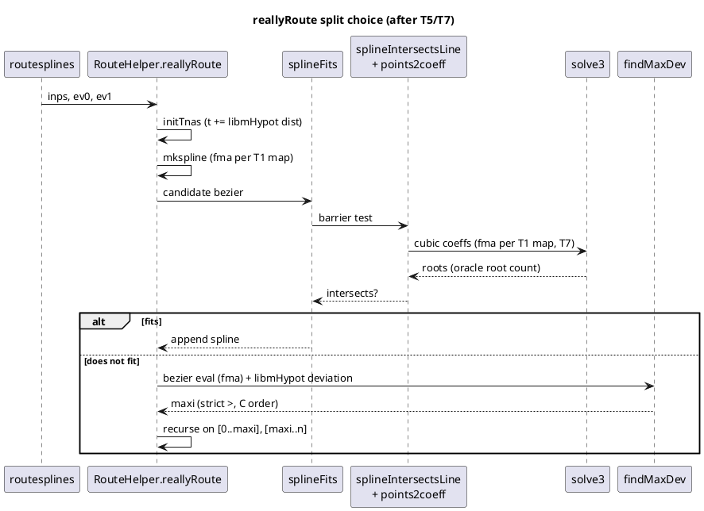
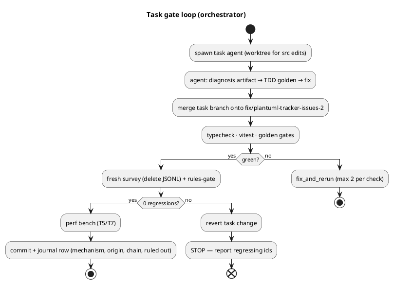

# Data flow — spline split decision (T5/T7) and the verification loop

## Spline fitting: where the tie is decided

```plantuml
@startuml
title reallyRoute split choice (after T5/T7)
participant "routesplines" as RS
participant "RouteHelper.reallyRoute" as RR
participant "splineFits" as SF
participant "splineIntersectsLine\n+ points2coeff" as SIL
participant "solve3" as S3
participant "findMaxDev" as FMD

RS -> RR : inps, ev0, ev1
RR -> RR : initTnas (t += libmHypot dist)
RR -> RR : mkspline (fma per T1 map)
RR -> SF : candidate bezier
SF -> SIL : barrier test
SIL -> S3 : cubic coeffs (fma per T1 map, T7)
S3 --> SIL : roots (oracle root count)
SIL --> SF : intersects?
alt fits
  SF --> RR : append spline
else does not fit
  RR -> FMD : bezier eval (fma) + libmHypot deviation
  FMD --> RR : maxi (strict >, C order)
  RR -> RR : recurse on [0..maxi], [maxi..n]
end
@enduml
```

## Verification loop per task

```plantuml
@startuml
title Task gate loop (orchestrator)
start
:spawn task agent (worktree for src edits);
:agent: diagnosis artifact → TDD golden → fix;
:merge task branch onto fix/plantuml-tracker-issues-2;
:typecheck · vitest · golden gates;
if (green?) then (yes)
  :fresh survey (delete JSONL) + rules-gate;
  if (0 regressions?) then (yes)
    :perf bench (T5/T7);
    :commit + journal row (mechanism, origin, chain, ruled out);
    stop
  else (no)
    :revert task change;
    :STOP — report regressing ids;
    end
  endif
else (no)
  :fix_and_rerun (max 2 per check);
  stop
endif
@enduml
```
