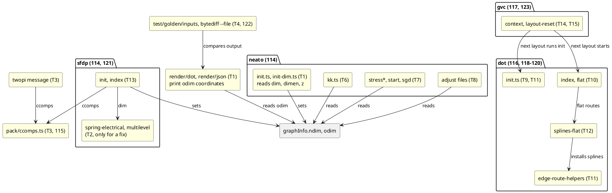

# Component map: part 10

Components touched by items 114–124, and how they relate. Shaded = modified.

```plantuml
@startuml
skinparam componentStyle rectangle
package "neato (114)" {
  [init.ts, init-dim.ts (T1)\nreads dim, dimen, z] as NI #LightYellow
  [kk.ts (T6)] as KK #LightYellow
  [stress*, start, sgd (T7)] as ST #LightYellow
  [adjust files (T8)] as ADJ #LightYellow
}
package "sfdp (114, 121)" {
  [init, index (T13)] as SI #LightYellow
  [spring-electrical, multilevel\n(T2, only for a fix)] as SE #LightYellow
}
package "dot (116, 118-120)" {
  [init.ts (T9, T11)] as DI #LightYellow
  [index, flat (T10)] as DF #LightYellow
  [edge-route-helpers (T11)] as ER #LightYellow
  [splines-flat (T12)] as SP #LightYellow
}
package "gvc (117, 123)" {
  [context, layout-reset (T14, T15)] as CTX #LightYellow
}
[pack/ccomps.ts (T3, 115)] as CC #LightYellow
[twopi message (T3)] as TW #LightYellow
[render/dot, render/json (T1)\nprint odim coordinates] as RD #LightYellow
[test/golden/inputs, bytediff --file (T4, 122)] as GOLD #LightYellow
[graphInfo.ndim, odim] as GI
NI --> GI : sets
SI --> GI : sets
KK --> GI : reads
ST --> GI : reads
ADJ --> GI : reads
RD --> GI : reads odim
SI --> SE : dim
SI --> CC : ccomps
TW --> CC : ccomps
CTX --> DI : next layout runs init
CTX --> DF : next layout starts
DF --> SP : flat routes
SP --> ER : installs splines
GOLD --> RD : compares output
@enduml
```
