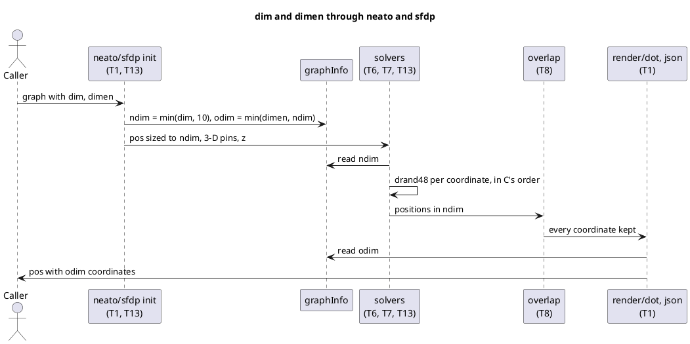
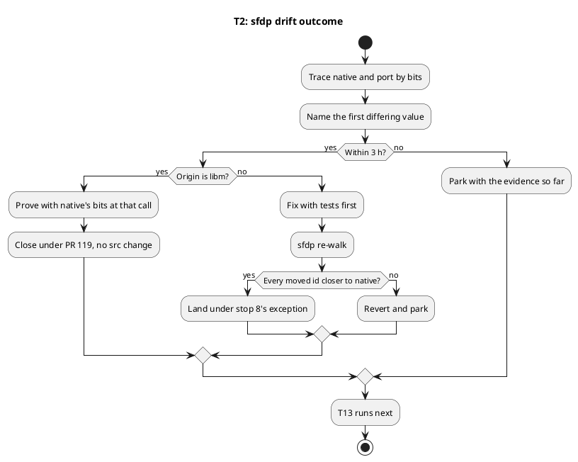

# Data flow: part 10

How `dim` reaches output (114), and the decision on sfdp's drift (121).

```plantuml
@startuml
title dim and dimen through neato and sfdp
actor Caller
participant "neato/sfdp init\n(T1, T13)" as Init
participant "graphInfo" as GI
participant "solvers\n(T6, T7, T13)" as Solve
participant "overlap\n(T8)" as Adj
participant "render/dot, json\n(T1)" as Out
Caller -> Init : graph with dim, dimen
Init -> GI : ndim = min(dim, 10), odim = min(dimen, ndim)
Init -> Solve : pos sized to ndim, 3-D pins, z
Solve -> GI : read ndim
Solve -> Solve : drand48 per coordinate, in C's order
Solve -> Adj : positions in ndim
Adj -> Out : every coordinate kept
Out -> GI : read odim
Out -> Caller : pos with odim coordinates
@enduml
```

```plantuml
@startuml
title T2: sfdp drift outcome
start
:Trace native and port by bits;
:Name the first differing value;
if (Within 3 h?) then (yes)
  if (Origin is libm?) then (yes)
    :Prove with native's bits at that call;
    :Close under PR 119, no src change;
  else (no)
    :Fix with tests first;
    :sfdp re-walk;
    if (Every moved id closer to native?) then (yes)
      :Land under stop 8's exception;
    else (no)
      :Revert and park;
    endif
  endif
else (no)
  :Park with the evidence so far;
endif
:T13 runs next;
stop
@enduml
```
