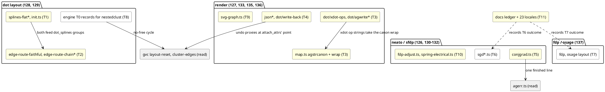

# Component map: part 11

Components touched by items 126–138, by task. Shaded = modified; dashed = modified only if the diagnosis finds the cause
in the port.

```plantuml
@startuml
skinparam componentStyle rectangle
package "dot layout (128, 129)" {
  [splines-flat*, init.ts (T1)] as FLAT #LightYellow
  [edge-route-faithful, edge-route-chain* (T2)] as CHAIN #LightYellow
  [engine T0 records for nestedclust (T8)] as NC #White
}
package "render (127, 133, 135, 136)" {
  [map.ts agstrcanon + wrap (T3)] as CANON #LightYellow
  [dot/xdot-ops, dot/agwrite* (T3)] as XW #LightYellow
  [json*, dot/write-back (T4)] as JSON #LightYellow
  [svg-graph.ts (T9)] as SVG #LightYellow
}
package "neato / sfdp (126, 130-132)" {
  [conjgrad.ts (T5)] as CG #LightYellow
  [sgd*.ts (T6)] as SGD #White
  [fdp-adjust.ts, spring-electrical.ts (T10)] as CLEAN #LightYellow
}
package "fdp / osage (137)" {
  [fdp, osage layout (T7)] as FO #White
}
[gvc layout-reset, cluster-edges (read)] as RESET
[agerr.ts (read)] as AGERR
[docs ledger + 23 locales (T11)] as DOCS #LightYellow

XW --> CANON : xdot op strings take the canon wrap
JSON --> RESET : undo proxies at attach_attrs' point
CG --> AGERR : one finished line
FLAT --> CHAIN : both feed dot_splines groups
NC --> RESET : no-free cycle
DOCS ..> SGD : records T6 outcome
DOCS ..> FO : records T7 outcome
@enduml
```
