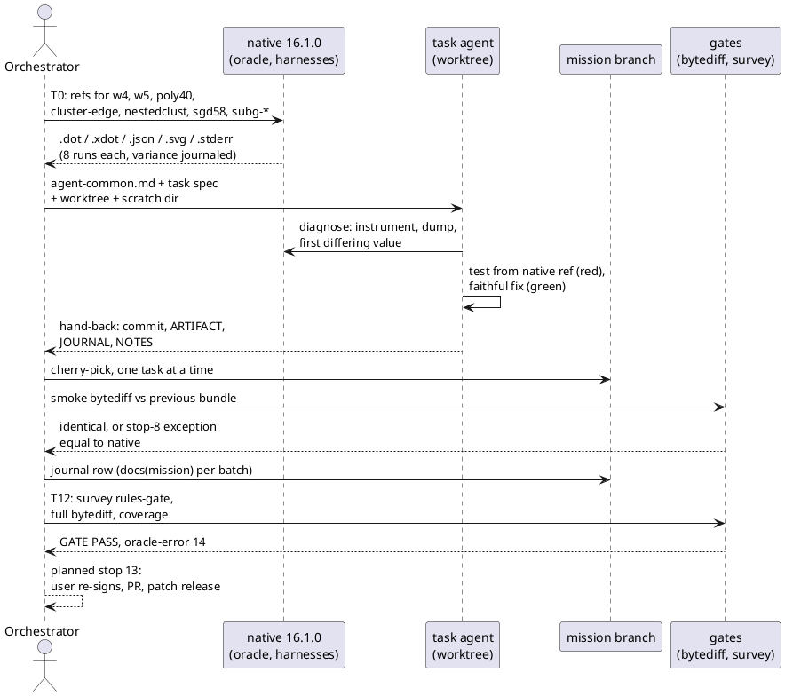

# Data flow: part 11

How a task's change travels from the C spec to the landed commit, and where each gate sits.

```plantuml
@startuml
actor Orchestrator as O
participant "native 16.1.0\n(oracle, harnesses)" as N
participant "task agent\n(worktree)" as A
participant "mission branch" as B
participant "gates\n(bytediff, survey)" as G

O -> N : T0: refs for w4, w5, poly40,\ncluster-edge, nestedclust, sgd58, subg-*
N --> O : .dot / .xdot / .json / .svg / .stderr\n(8 runs each, variance journaled)
O -> A : agent-common.md + task spec\n+ worktree + scratch dir
A -> N : diagnose: instrument, dump,\nfirst differing value
A -> A : test from native ref (red),\nfaithful fix (green)
A --> O : hand-back: commit, ARTIFACT,\nJOURNAL, NOTES
O -> B : cherry-pick, one task at a time
O -> G : smoke bytediff vs previous bundle
G --> O : identical, or stop-8 exception\nequal to native
O -> B : journal row (docs(mission) per batch)
O -> G : T12: survey rules-gate,\nfull bytediff, coverage
G --> O : GATE PASS, oracle-error 14
O --> O : planned stop 13:\nuser re-signs, PR, patch release
@enduml
```
