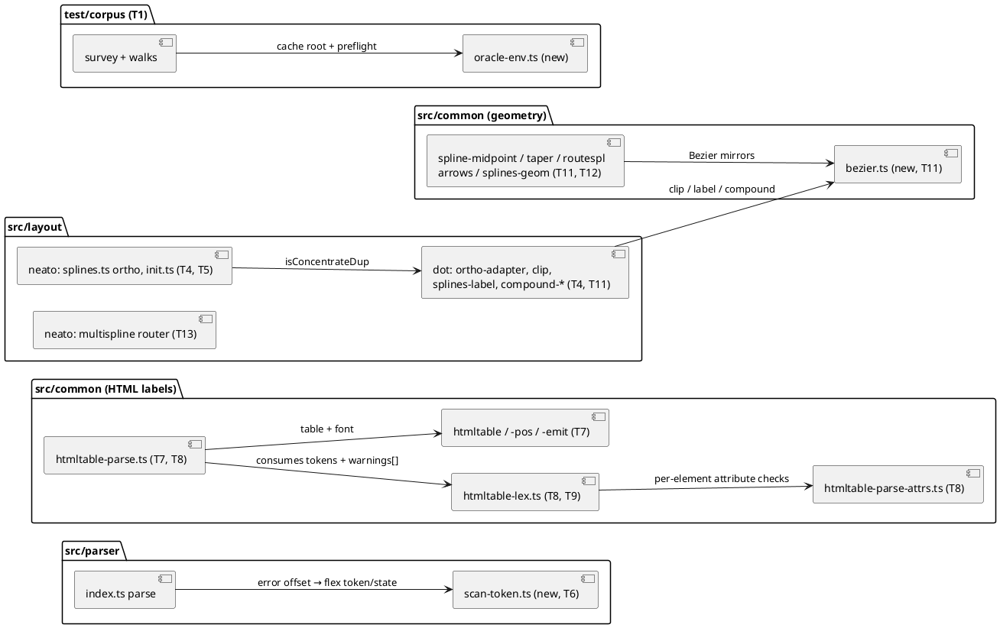

# Components touched (proposed)

```plantuml
@startuml
left to right direction
package "src/parser" {
  [index.ts parse] as parse
  [scan-token.ts (new, T6)] as scantok
}
package "src/common (HTML labels)" {
  [htmltable-lex.ts (T8, T9)] as lex
  [htmltable-parse-attrs.ts (T8)] as attrs
  [htmltable-parse.ts (T7, T8)] as hparse
  [htmltable / -pos / -emit (T7)] as hlayout
}
package "src/common (geometry)" {
  [bezier.ts (new, T11)] as bez
  [spline-midpoint / taper / routespl\narrows / splines-geom (T11, T12)] as geom
}
package "src/layout" {
  [dot: ortho-adapter, clip,\nsplines-label, compound-* (T4, T11)] as dot
  [neato: splines.ts ortho, init.ts (T4, T5)] as neato
  [neato: multispline router (T13)] as ms
}
package "test/corpus (T1)" {
  [oracle-env.ts (new)] as oenv
  [survey + walks] as walks
}
parse --> scantok : error offset → flex token/state
hparse --> lex : consumes tokens + warnings[]
lex --> attrs : per-element attribute checks
hparse --> hlayout : table + font
dot --> bez : clip / label / compound
geom --> bez : Bezier mirrors
neato --> dot : isConcentrateDup
walks --> oenv : cache root + preflight
@enduml
```
