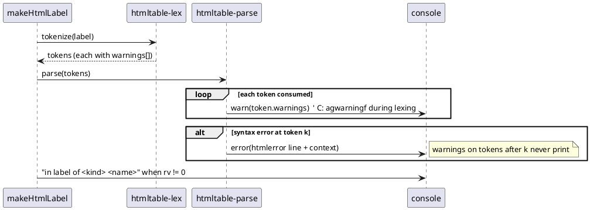
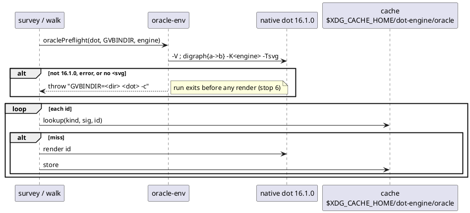

# Key flows (proposed)

## HTML label warnings (T8, T9): print only what C's interleaved lexer would reach

```plantuml
@startuml
participant "makeHtmlLabel" as mk
participant "htmltable-lex" as lex
participant "htmltable-parse" as parse
participant "console" as con
mk -> lex : tokenize(label)
lex --> mk : tokens (each with warnings[])
mk -> parse : parse(tokens)
loop each token consumed
  parse -> con : warn(token.warnings)  ' C: agwarningf during lexing
end
alt syntax error at token k
  parse -> con : error(htmlerror line + context)
  note right : warnings on tokens after k never print
end
mk -> con : "in label of <kind> <name>" when rv != 0
@enduml
```

## Oracle runs (T1): preflight, then a persistent cache

```plantuml
@startuml
participant "survey / walk" as run
participant "oracle-env" as env
participant "native dot 16.1.0" as dot
participant "cache\n$XDG_CACHE_HOME/dot-engine/oracle" as cache
run -> env : oraclePreflight(dot, GVBINDIR, engine)
env -> dot : -V ; digraph{a->b} -K<engine> -Tsvg
alt not 16.1.0, error, or no <svg
  env --> run : throw "GVBINDIR=<dir> <dot> -c"
  note right : run exits before any render (stop 6)
end
loop each id
  run -> cache : lookup(kind, sig, id)
  alt miss
    run -> dot : render id
    run -> cache : store
  end
end
@enduml
```
