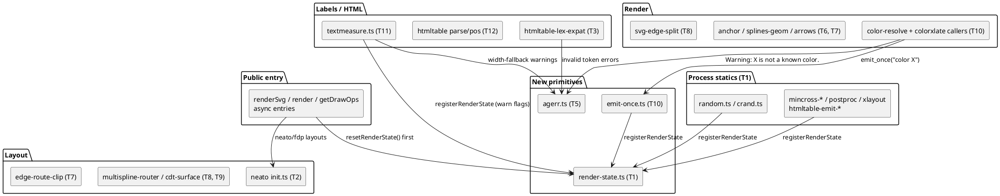

# Component map

Components each task touches (task IDs on the components) and the two shared primitives
this mission adds: `render-state` (T1, AD-4) and `agerr` (T5, AD-5).

```plantuml
@startuml
skinparam componentStyle rectangle
package "Public entry" {
  [renderSvg / render / getDrawOps\nasync entries] as Entry
}
package "New primitives" {
  [render-state.ts (T1)] as RS
  [agerr.ts (T5)] as AG
  [emit-once.ts (T10)] as EO
}
package "Process statics (T1)" {
  [random.ts / crand.ts] as Rng
  [mincross-* / postproc / xlayout\nhtmltable-emit-*] as Stat
}
package "Layout" {
  [neato init.ts (T2)] as Init
  [multispline-router / cdt-surface (T8, T9)] as MS
  [edge-route-clip (T7)] as Clip
}
package "Labels / HTML" {
  [htmltable-lex-expat (T3)] as Lex
  [htmltable parse/pos (T12)] as Pos
  [textmeasure.ts (T11)] as TM
}
package "Render" {
  [color-resolve + colorxlate callers (T10)] as Col
  [anchor / splines-geom / arrows (T6, T7)] as Geo
  [svg-edge-split (T8)] as Split
}
Entry --> RS : resetRenderState() first
Rng --> RS : registerRenderState
Stat --> RS : registerRenderState
EO --> RS : registerRenderState
TM --> RS : registerRenderState (warn flags)
Col --> EO : emit_once("color X")
Col --> AG : Warning: X is not a known color.
TM --> AG : width-fallback warnings
Lex --> AG : invalid token errors
Entry --> Init : neato/fdp layouts
@enduml
```
