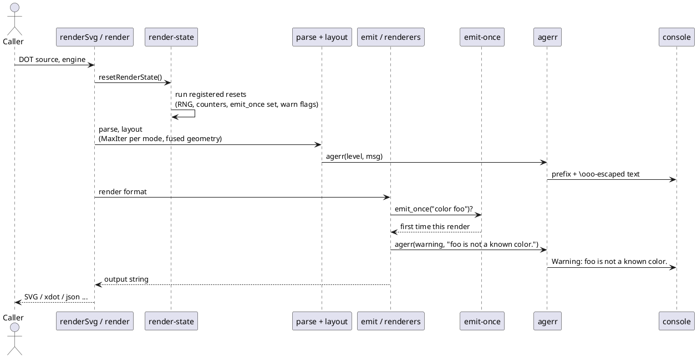

# Data flow: one render call after this mission

One public render behaves like one native `dot` process (AD-4); every agerr-class message
leaves through one writer (AD-5).

```plantuml
@startuml
actor Caller
participant "renderSvg / render" as Entry
participant "render-state" as RS
participant "parse + layout" as Layout
participant "emit / renderers" as Emit
participant "emit-once" as EO
participant "agerr" as AG
participant "console" as Con

Caller -> Entry : DOT source, engine
Entry -> RS : resetRenderState()
RS -> RS : run registered resets\n(RNG, counters, emit_once set, warn flags)
Entry -> Layout : parse, layout\n(MaxIter per mode, fused geometry)
Layout -> AG : agerr(level, msg)
AG -> Con : prefix + \\ooo-escaped text
Entry -> Emit : render format
Emit -> EO : emit_once("color foo")?
EO --> Emit : first time this render
Emit -> AG : agerr(warning, "foo is not a known color.")
AG -> Con : Warning: foo is not a known color.
Emit --> Entry : output string
Entry --> Caller : SVG / xdot / json ...
@enduml
```
