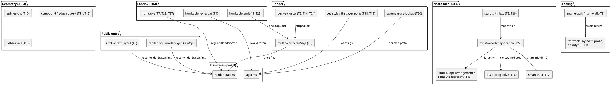

# Component map

Components each task touches (task IDs on the components) and the two part-3 primitives
this mission extends: `render-state` (T7, T8, T6, T23) and `agerr` (T5, T18–T20, T24).

```plantuml
@startuml
skinparam componentStyle rectangle
package "Public entry" {
  [GvcContext.layout (T8)] as Ctx
  [renderSvg / render / getDrawOps] as Entry
}
package "Primitives (part 3)" {
  [render-state.ts] as RS
  [agerr.ts] as AG
}
package "Neato hier (AD-6)" {
  [kkutils / opt-arrangement /\ncompute-hierarchy (T15)] as CH
  [quad-prog-solve (T16)] as QP
  [smart-ini-x (T17)] as SI
  [constrained-majorization (T22)] as CM
  [start.ts / init.ts (T5, T26)] as Start
}
package "Geometry (AD-4)" {
  [splines-clip (T10)] as SC
  [compound / edge-route-* (T11, T12)] as DC
  [cdt-surface (T13)] as CDT
}
package "Labels / HTML" {
  [htmltable-lex-expat (T4)] as Lex
  [htmltable (T7, T23, T27)] as HT
  [htmltable-emit-fill (T25)] as Fill
}
package "Render" {
  [multicolor parseSegs (T6)] as MC
  [device-cluster (T6, T14, T24)] as Clu
  [set_style / firstlayer ports (T18, T19)] as Rend
  [textmeasure-lookup (T20)] as TM
}
package "Tooling" {
  [test/tools: bytediff, probe,\nclassify (T0, T1)] as Tools
  [engine-walk / json-walk (T3)] as Walk
}
Ctx --> RS : resetRenderState() first
Entry --> RS : resetRenderState() first
HT --> RS : registerRenderState
MC --> RS : once flag
Start --> CM : mode=hier
CM --> CH : hierarchy
CM --> QP : constrained step
CM --> SI : smart init (dim 2)
Fill --> MC : findStopColor
Clu --> MC : stripedBox
Lex --> AG : invalid token
Rend --> AG : warnings
TM --> AG : doubled prefix
Walk --> Tools : oracle reruns
@enduml
```
