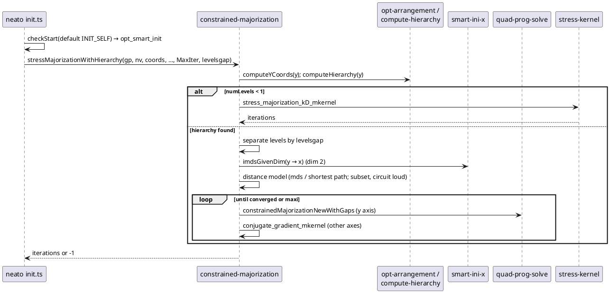
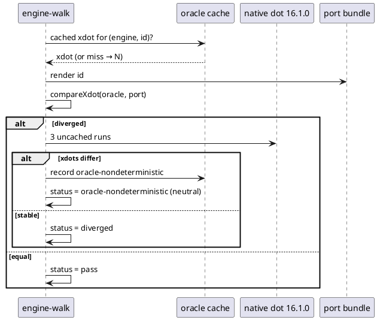

# Data flow

## Neato `mode=hier` layout (T15–T17, T22, T26)

```plantuml
@startuml
participant "neato init.ts" as Init
participant "constrained-majorization" as CM
participant "opt-arrangement /\ncompute-hierarchy" as CH
participant "smart-ini-x" as SI
participant "quad-prog-solve" as QP
participant "stress-kernel" as SK
Init -> Init : checkStart(default INIT_SELF) → opt_smart_init
Init -> CM : stressMajorizationWithHierarchy(gp, nv, coords, …, MaxIter, levelsgap)
CM -> CH : computeYCoords(y); computeHierarchy(y)
alt numLevels < 1
  CM -> SK : stress_majorization_kD_mkernel
  SK --> CM : iterations
else hierarchy found
  CM -> CM : separate levels by levelsgap
  CM -> SI : imdsGivenDim(y → x) (dim 2)
  CM -> CM : distance model (mds / shortest path; subset, circuit loud)
  loop until converged or maxi
    CM -> QP : constrainedMajorizationNewWithGaps (y axis)
    CM -> CM : conjugate_gradient_mkernel (other axes)
  end
end
CM --> Init : iterations or -1
@enduml
```

## Walk verdict with oracle nondeterminism (T3)

```plantuml
@startuml
participant "engine-walk" as W
participant "oracle cache" as C
participant "native dot 16.1.0" as N
participant "port bundle" as P
W -> C : cached xdot for (engine, id)?
C --> W : xdot (or miss → N)
W -> P : render id
W -> W : compareXdot(oracle, port)
alt diverged
  W -> N : 3 uncached runs
  alt xdots differ
    W -> C : record oracle-nondeterministic
    W -> W : status = oracle-nondeterministic (neutral)
  else stable
    W -> W : status = diverged
  end
else equal
  W -> W : status = pass
end
@enduml
```
