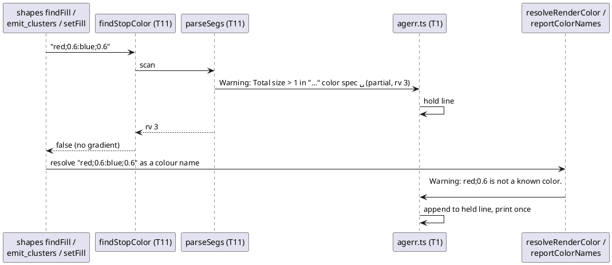
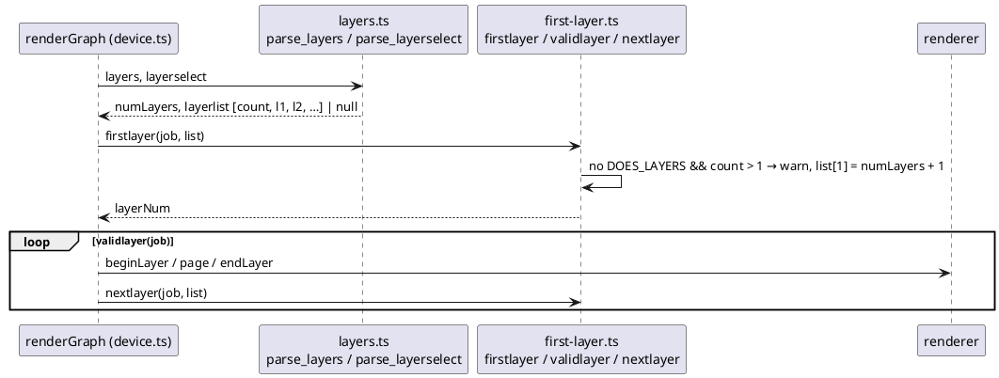
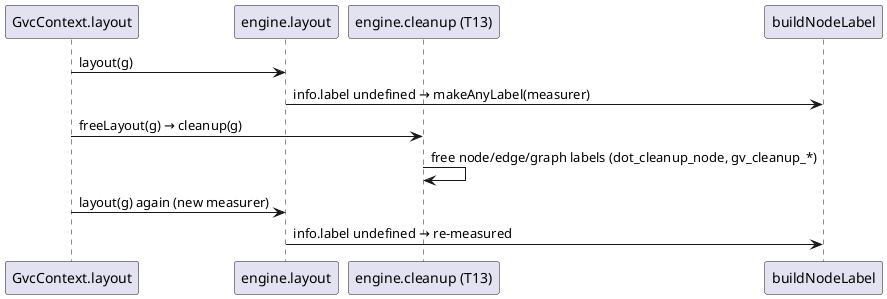

# Data flow

## Joined colour warnings (T1, T11; items 75, 77, 82)

```plantuml
@startuml
participant "shapes findFill /\nemit_clusters / setFill" as Caller
participant "findStopColor (T11)" as FSC
participant "parseSegs (T11)" as PS
participant "agerr.ts (T1)" as AG
participant "resolveRenderColor /\nreportColorNames" as CR
Caller -> FSC : "red;0.6:blue;0.6"
FSC -> PS : scan
PS -> AG : Warning: Total size > 1 in "…" color spec ␣ (partial, rv 3)
AG -> AG : hold line
PS --> FSC : rv 3
FSC --> Caller : false (no gradient)
Caller -> CR : resolve "red;0.6:blue;0.6" as a colour name
CR -> AG : Warning: red;0.6 is not a known color.\n
AG -> AG : append to held line, print once
@enduml
```

## Layer walk (T12; item 79)

```plantuml
@startuml
participant "renderGraph (device.ts)" as RG
participant "layers.ts\nparse_layers / parse_layerselect" as PL
participant "first-layer.ts\nfirstlayer / validlayer / nextlayer" as FL
participant "renderer" as R
RG -> PL : layers, layerselect
PL --> RG : numLayers, layerlist [count, l1, l2, …] | null
RG -> FL : firstlayer(job, list)
FL -> FL : no DOES_LAYERS && count > 1 → warn, list[1] = numLayers + 1
FL --> RG : layerNum
loop validlayer(job)
  RG -> R : beginLayer / page / endLayer
  RG -> FL : nextlayer(job, list)
end
@enduml
```

## Second layout of the same Graph (T13; item 72)

```plantuml
@startuml
participant "GvcContext.layout" as L
participant "engine.layout" as E
participant "engine.cleanup (T13)" as C
participant "buildNodeLabel" as B
L -> E : layout(g)
E -> B : info.label undefined → makeAnyLabel(measurer)
L -> C : freeLayout(g) → cleanup(g)
C -> C : free node/edge/graph labels (dot_cleanup_node, gv_cleanup_*)
L -> E : layout(g) again (new measurer)
E -> B : info.label undefined → re-measured
@enduml
```
